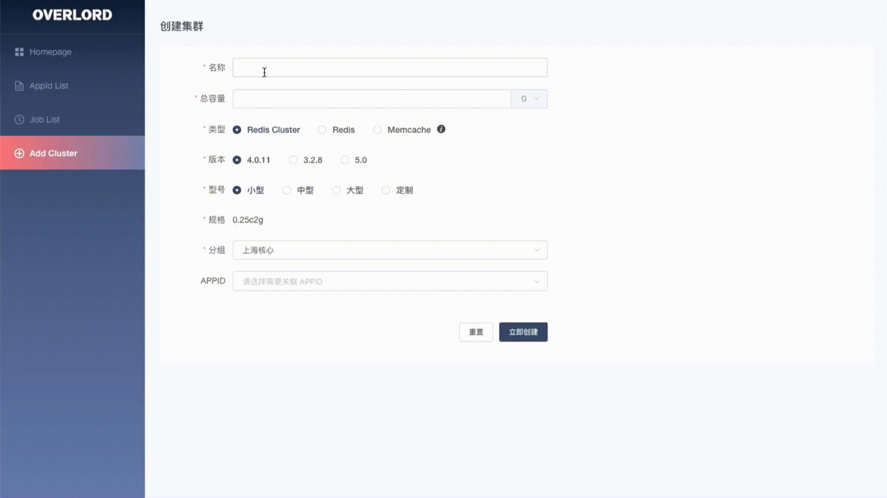
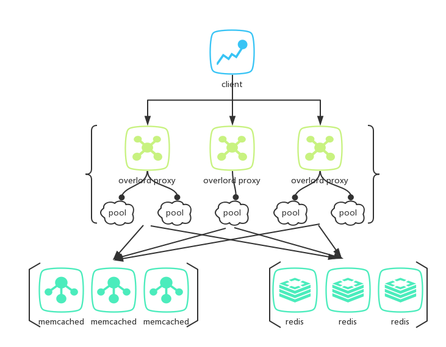
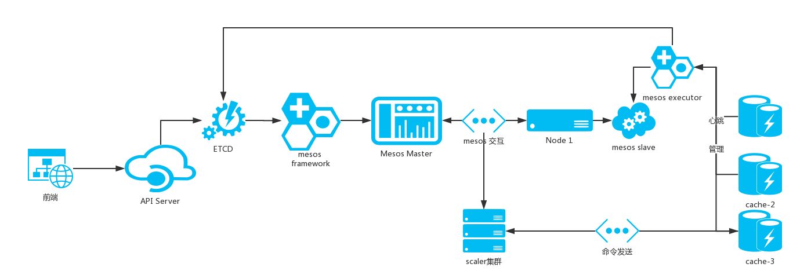

# Overlord 
 
 

Overlord是[哔哩哔哩](https://www.bilibili.com)基于Go语言编写的memcache和redis&cluster的代理及集群管理功能，致力于提供自动化高可用的缓存服务解决方案。主要包括以下组件:  

* [proxy](doc/wiki-cn/proxy-usage.md)：轻量高可用的缓存代理模块，支持memcache和redis的代理，相当于twemproxy，不同在于支持redis-cluster及能将自己伪装为cluster模式。
* [platform](doc/wiki-cn/platform-deploy.md)：包含apiserver、mesos framework&executor、集群节点任务管理job等。
* [GUI](doc/wiki-cn/platform-usage.md)：web管理界面，通过dashboard可视化方便用于集群管理，包括创建删除、扩缩容、加减节点等。
* [anzi](doc/wiki-cn/tools.md)：redis-cluster的数据同步工具，可服务化与apiserver进行配合工作。
* [enri](doc/wiki-cn/tools.md)：redis-cluster的集群管理工具，可灵活的创建集群、迁移slot等。

Overlord已被哔哩哔哩用于生产环境。

## Document
[简体中文](doc/wiki-cn/SUMMARY.md)

## GUI

## Architecture

## Cache-Platform

基于mesos&etcd提供了自动化的缓存节点管理平台

-------------

*Please report bugs, concerns, suggestions by issues, or join QQ-group 716486124 to discuss problems around source code.*
