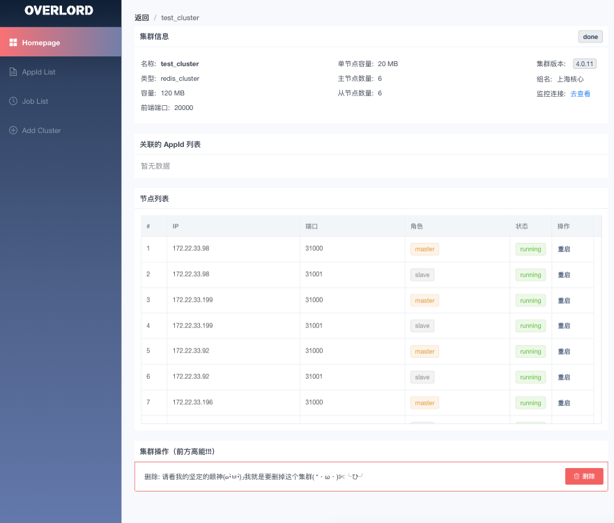
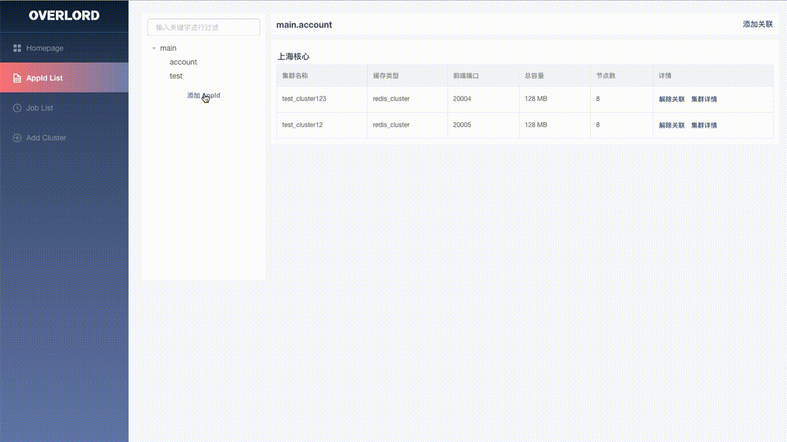
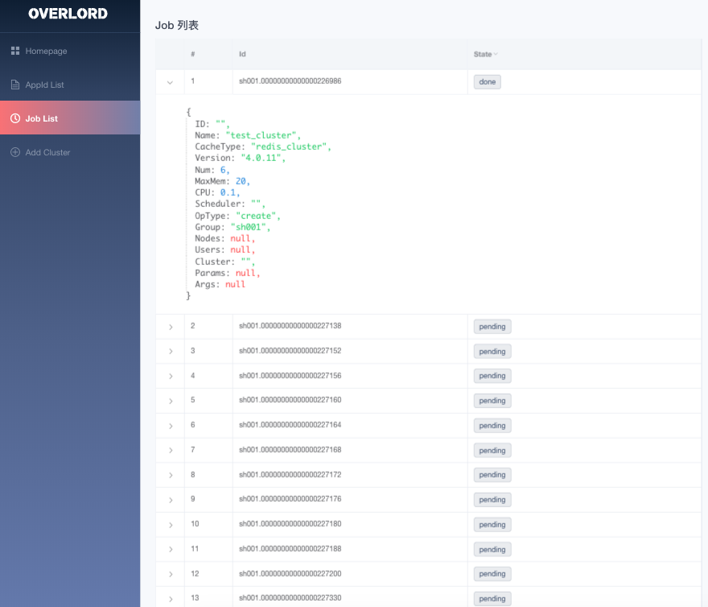

# overlord-platform 使用指南

## 创建集群

填写名称、总容量(支持单位 G/M )、集群类型（推荐使用 Redis Cluster、版本、型号（支持定制）、分组，APPID 信息为选填内容。
填写完成后点击 立即创建 按钮，将会自动跳转至集群详情页。

## 查看集群详情

*删除集群操作前请务必解除 Appid 关联关系*

## 查看 Appid 列表

1. 查看与 Appid 有关联的集群信息，可通过*添加关联*按钮为当前 Appid 继续添加集群。
2. 点击集群列表右侧到*解除关联*按钮，可将解除当前 Appid 和集群的关联关系。
3. 点击 Appid 列表底部的*添加 Appid*按钮，可创建 Appid。

## 查看 Job 列表

